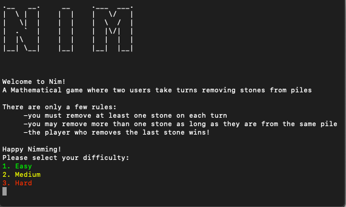
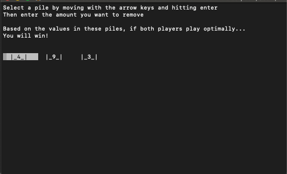
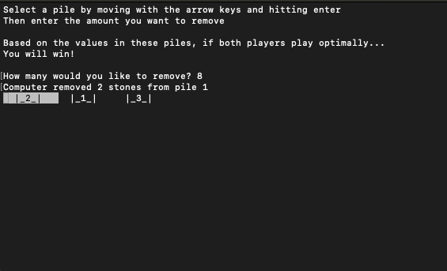

# Nim

## Description

Nim is a game where two players take turns removing items from three different piles. On a turn, the player removes any number of items from any same pile, and must at least take one item. The winner is the last person to remove a stone. 
The strategy has been mathematically proven for all initial pile/item combinations and calculated using binary digital sum of the piles, otherwise known as the Nim Sum. The goal is to acheive a Nim Sum of zero at the end of your turn.
A computer does this by summing the binary values of all piles and ignoring the carried digits. This operations is called "exclusive or" represented by a ```^``` character in most languages.

Here is an example of how a simple game play would look like:<br>


## Installation

1. Clone this repository
    * ```git clone https://github.com/MeStock/nim.git```
2. Build and start the program

## How to Play

1. Select your difficulty:
     
2. Make a move:
    * Use arrow keys to move from pile to pile
    * Hit enter to select a pile
    * Enter the amount of items you would like to remove from the selected pile
     
3. See the computers move
     
4. Continue until the game is over

## Features

* Difficulties:
    * Easy: 25% chance computer will choose optimal move
    * Medium: 50% chance computer will choose optimal move
    * Hard: Computer will play optimally
* Prediction:
    * Use Grundy Number & Nim sum to calculate winner based on number of stones at start of game

## Resources

* [Game Theory & Math Proof - Wikipedia](https://en.wikipedia.org/wiki/Nim)<br>
* [Game Theory - Geeks For Geeks](https://www.geeksforgeeks.org/combinatorial-game-theory-set-2-game-nim/)<br>
* [Calculating Winner - Geeks For Geeks](https://www.geeksforgeeks.org/find-winner-nim-game/)<br>
* [Winning Odds - Medium Article](https://medium.com/100-days-of-algorithms/day-90-simple-nim-ai-864b2fdf9e8a)<br>
* [Algorithm - OpenGenius](https://iq.opengenus.org/game-of-nim/)<br>
