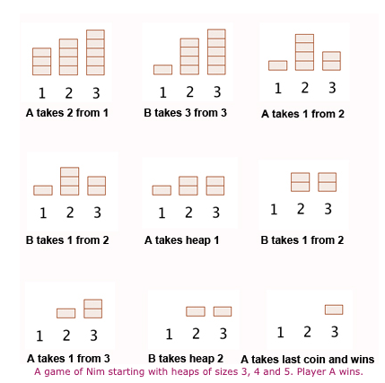

# Nim

## Description

Nim is a game where two players take turns removing items from three different piles. 

Rules:
   * You must remove at least one item on your turn
   * You can take any number of items from the same pile
   * Player who removes the last item wins

The strategy is to calculate pile/item combinations using a "Nim Sum". Nim Sum is the sum in binary that ignores all carries. The goal is to acheive a Nim Sum of zero at the end of your turn. It has been mathematically proven that starting your turn with a nim sum not equal to zero is a winning position - because there is always at least one move that will turn the nim sum to zero. Starting your turn with a nim sum of zero is called a losing position.

Example of Nim Sum calculation:

Piles = { 3 4 5 }<br>
Binary:<br>
&nbsp;&nbsp;&nbsp;3 = 0 1 1 + <br>
&nbsp;&nbsp;&nbsp;4 = 1 0 0 + <br>
&nbsp;&nbsp;&nbsp;5 = 1 0 1 + <br>
&nbsp;&nbsp;&nbsp;&nbsp;&nbsp;&nbsp;= 0 1 0 ← 2 <br>

Nim Sum = 2. In this example, since the Nim Sum is 2, the player who currently has the turn will win if each player plays optimally. A computer calculates this by using operan called "exclusive or" or XOR represented by a ```^``` character in most languages. ```nimSum = pile1 ^ pile2 ^ pile3;```

Here is an example of how a simple game play would look:<br>


## Installation

1. Clone this repository
    * ```git clone https://github.com/MeStock/nim.git```
2. Build and start the program

## How to Play

1. Select your difficulty:<br>
     <br>
2. Make a move:
    * Use arrow keys to move from pile to pile
    * Hit enter to select a pile
    * Enter the amount of items you would like to remove from the selected pile<br>
    <br>
3. See the computers move<br>
    <br>
4. Continue until the game is over

## Algorithm
We saw in the previous example that for piles = { 3 4 5}, the nim sum = 2. 
This is a winning position.

We check each value against the nim sum using XOR:<br>
    * 3 ^ 2 = 1 ← notice that 1 < 3<br>
    * 4 ^ 2 = 6<br>
    * 5 ^ 2 = 7<br>
The optimal move here is to reduce 3 to 1. Why? Because 1 ^ 4 ^ 5 = 0. 
This is a losing position.

## Features

* Difficulties:
    * Easy: 25% chance computer will choose optimal move
    * Medium: 50% chance computer will choose optimal move
    * Hard: Computer will play optimally
* Prediction:
    * Use Grundy Number & Nim sum to calculate winner based on number of stones at start of game

## Resources

* [Game Theory & Math Proof - Wikipedia](https://en.wikipedia.org/wiki/Nim)<br>
* [Game Theory - Geeks For Geeks](https://www.geeksforgeeks.org/combinatorial-game-theory-set-2-game-nim/)<br>
* [Calculating Winner - Geeks For Geeks](https://www.geeksforgeeks.org/find-winner-nim-game/)<br>
* [Winning Odds - Medium Article](https://medium.com/100-days-of-algorithms/day-90-simple-nim-ai-864b2fdf9e8a)<br>
* [Algorithm - OpenGenius](https://iq.opengenus.org/game-of-nim/)<br>
